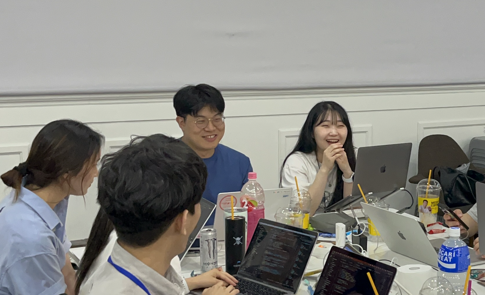

# Sopkathon Server

## 팀원 및 역할

|                  **🙋 [이영주](https://github.com/2zerozu)**                   |                **🙋 [최윤한](https://github.com/unanchoi)**                 |
|:---------------------------------------------------------------------------:| :-------------------------------------------------------------------------: |
|  |  |
|                                   서버 개발자                                    |                                 서버 개발자                                 |
|               프로젝트 세팅 서버 배포 DB 설계 Api 작성                |        프로젝트 세팅 서버 배포 DB 설계 Api 작성         |

## 코드 컨벤션
[코드 컨벤션](https://busy-tern-9b7.notion.site/c4ccd96333594488ba91a80296536c4f)
## Git 전략
[깃 컨벤션](https://busy-tern-9b7.notion.site/60f6499d6b494de994f0c2f15cc35114)
## ERD

## API 명세서

## 프로젝트 구조
- src
    - main
        - java
            - com.sopt.sopkathonproduct
                - common
                - config
                - controller
                - domain
                  - entity
                - dto
                - exception
                - repository
                - service
                - util
                - SopkathonProductApplication.java
        - resources
            - application.yml
    - test
        - java
            - com.sopt.sopkathonproduct
                - SopkathonProductApplicationTests.java
        - resources
            - application.yml

### 1차 과제 화목한 서버
